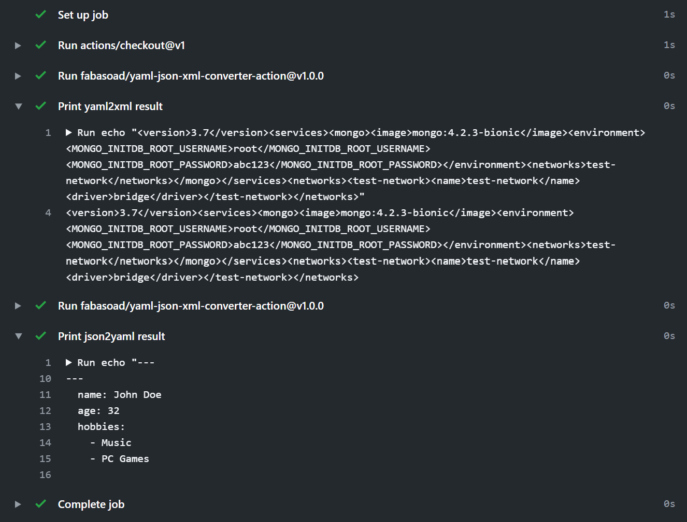

# YAML/JSON/XML action

    [](https://lgtm.com/projects/g/fabasoad/yaml-json-xml-converter-action/alerts/) [](https://lgtm.com/projects/g/fabasoad/yaml-json-xml-converter-action/context:javascript) [](https://snyk.io/test/github/fabasoad/yaml-json-xml-converter-action) [](https://codeclimate.com/github/fabasoad/yaml-json-xml-converter-action/maintainability) [](https://codeclimate.com/github/fabasoad/yaml-json-xml-converter-action/test_coverage)

Converts YAML/JSON/XML file formats interchangeably.

## Inputs

| Name | Required | Description                      | Possible values       |
|------|----------|----------------------------------|-----------------------|
| path | Yes      | Path to the file to be converted | _&lt;Path&gt;_        |
| from | Yes      | Format of a file                 | `json`, `xml`, `yaml` |
| to   | Yes      | Format of a file as a result     | `json`, `xml`, `yaml` |

## Outputs

| Name | Required | Description                                 |
|------|----------|---------------------------------------------|
| data | Yes      | Result in a format defined in `to` argument |

## Example usage

### Prerequisites

Let's imagine we need to transform _yaml_ file into _xml_ format and _json_ file into _yaml_ format.

- `docker-compose.yml` file that will be transformed into _json_ file.

```yaml
---
version: '3.7'
services:
  mongo:
    image: mongo:4.2.3-bionic
    environment:
      MONGO_INITDB_ROOT_USERNAME: root
      MONGO_INITDB_ROOT_PASSWORD: abc123
    networks:
      - test-network

networks:
  test-network:
    name: test-network
    driver: bridge
```

- `person.json` file that will be transformed into _yaml_ file.

```json
{
    "name": "John Doe",
    "age": 32,
    "hobbies": ["Music", "PC Games"]
}
```

### Workflow configuration

```yaml
name: Convert

on: push

jobs:
  converter:
    name: Run converter
    runs-on: ubuntu-latest
    steps:
      - uses: actions/checkout@v1
      - uses: fabasoad/yaml-json-xml-converter-action@main
        id: yaml2xml
        with:
          path: 'docker-compose.yml'
          from: 'yaml'
          to: 'xml'
      - name: Print yaml2xml result
        run: echo "${{ steps.yaml2xml.outputs.data }}"
      - uses: fabasoad/yaml-json-xml-converter-action@main
        id: json2yaml
        with:
          path: 'package.json'
          from: 'json'
          to: 'yaml'
      - name: Print json2yaml result
        run: echo "${{ steps.json2yaml.outputs.data }}"
```

### Result



> _Hint:_ If you define the same format for `from` and `to` parameters you can use this action to read the file :wink:
